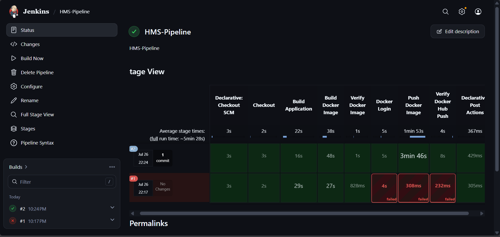
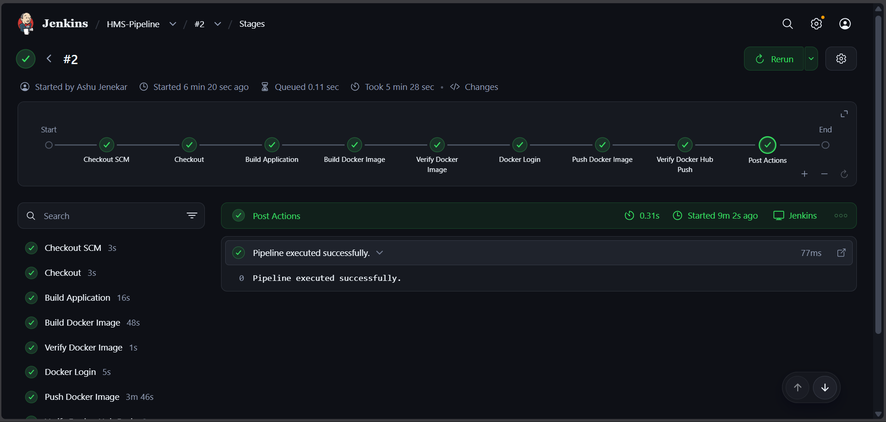

# 🏨 Hotel Management System (HMS)

A modern, responsive Hotel Management System web application built with **React 19** and **Vite**, containerized with **Docker**, served via **Nginx**, and configured for continuous deployment with **Jenkins**.

---

## 📸 Screenshots

> *Note: Add your screenshot image links below.*

| Home View | Rooms & Booking | Services |
| :---: | :---: | :---: |
| |  |  |

| JenkinsPipeline | Pipeline Structure |
| :---: | :---: |
| ||

---

## ✨ Features

- 🛏️ **Room Browsing & Booking**: View available rooms, amenities, pricing, and reservation options.
- 🍽️ **Hotel Services & Dining**: Explore dining, spa, gym, and event management services.
- ⚡ **Lightning Fast Performance**: Powered by React 19 and Vite for instant load times and dynamic updates.
- 🐳 **Containerized & Production Ready**: Multi-stage Docker build using lightweight Nginx Alpine image.
- 🤖 **CI/CD Integration**: Pre-configured `Jenkinsfile` for automated linting, building, and pushing docker images.

---

## 🛠️ Tech Stack

- **Frontend**: React 19, JavaScript (ES Modules), CSS3
- **Build Tool & Bundler**: Vite 8
- **Linter**: Oxlint
- **Containerization**: Docker (Multi-stage build)
- **Web Server**: Nginx (Alpine)
- **CI/CD Pipeline**: Jenkins

---

## 📋 Prerequisites

Before you begin, ensure you have the following installed on your system:

- [Node.js](https://nodejs.org/) (v20.x or higher recommended)
- [npm](https://www.npmjs.com/) (v10.x or higher)
- [Docker Desktop](https://www.docker.com/products/docker-desktop/) (Running on Windows, macOS, or Linux)
- A **Docker Hub** account (or custom container registry)

---

## 🚀 Getting Started & Building the Application

### 1. Clone the Repository
```bash
git clone https://github.com/your-username/Hotel-Management-System.git
cd Hotel-Management-System
```

### 2. Install Dependencies
```bash
npm install
```

### 3. Run Development Server
Start the local development server with Hot Module Replacement (HMR):
```bash
npm run dev
```
Open your browser and navigate to `http://localhost:5173`.

### 4. Code Quality & Linting
Run Oxlint to inspect the codebase for errors:
```bash
npm run lint
```

### 5. Build for Production (Local)
To create an optimized production bundle in the `dist/` directory:
```bash
npm run build
```
To test/preview the built application locally:
```bash
npm run preview
```

---

## 🐳 Docker Deployment & Registry Guide

### 1. Build the Docker Image
Build the Docker image locally. Replace `your-dockerhub-username` with your actual Docker Hub username (e.g., `ctslab`).

```bash
docker build -t your-dockerhub-username/hms:latest .
```

*Example:*
```bash
docker build -t ctslab/hms:latest .
```

### 2. Login to Docker Registry
Log in to your Docker Hub account from your terminal:

```bash
docker login -u your-dockerhub-username
```
*Enter your Docker Hub password or Personal Access Token when prompted.*

### 3. Push Image to Docker Registry
Push your built Docker image to Docker Hub so it can be deployed on any server or cloud environment:

```bash
docker push your-dockerhub-username/hms:latest
```

---

## 🖥️ Running Container in Docker Desktop

You can run and manage the container either via the **Command Line** or directly inside **Docker Desktop GUI**.

### Option A: Using Command Line

#### 1. Run the Container
Run the container detached (`-d`) mapping host port `80` to container port `80`:

```bash
docker run -d -p 80:80 --name hms-container your-dockerhub-username/hms:latest
```

#### 2. Access the Application
Open your web browser and navigate to:
```text
http://localhost
```

#### 3. Useful Docker Commands
- **Check running containers:**
  ```bash
  docker ps
  ```
- **View container logs:**
  ```bash
  docker logs -f hms-container
  ```
- **Stop the container:**
  ```bash
  docker stop hms-container
  ```
- **Remove the container:**
  ```bash
  docker rm hms-container
  ```

---

### Option B: Using Docker Desktop GUI

1. Open **Docker Desktop**.
2. Navigate to the **Images** tab on the left sidebar.
3. Locate `your-dockerhub-username/hms` (or `ctslab/hms`).
4. Click the **Run** button next to the image.
5. In the **Optional Settings** dropdown:
   - **Container Name**: Enter `hms-app` (or any name of your choice).
   - **Host Port**: Enter `80` (or `8080`).
6. Click **Run**.
7. Go to the **Containers** tab:
   - Click on the container name to inspect live logs, CPU/Memory usage stats, and filesystem.
   - Click on the port link (`80:80` or `http://localhost`) to launch the application directly in your browser.

---

## 📄 License

This project is open-source and available under the [MIT License](LICENSE).
